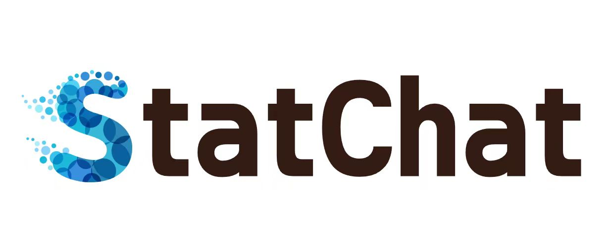
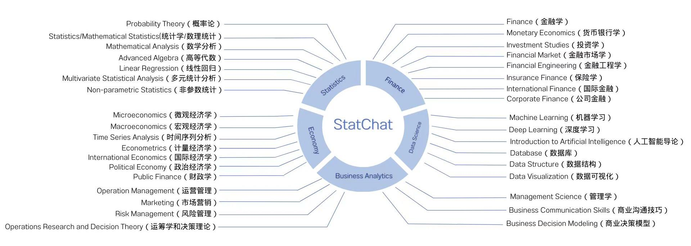
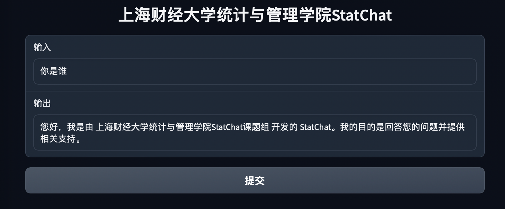
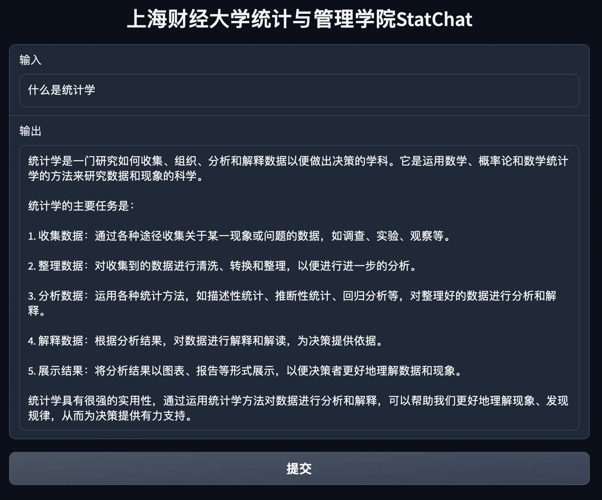
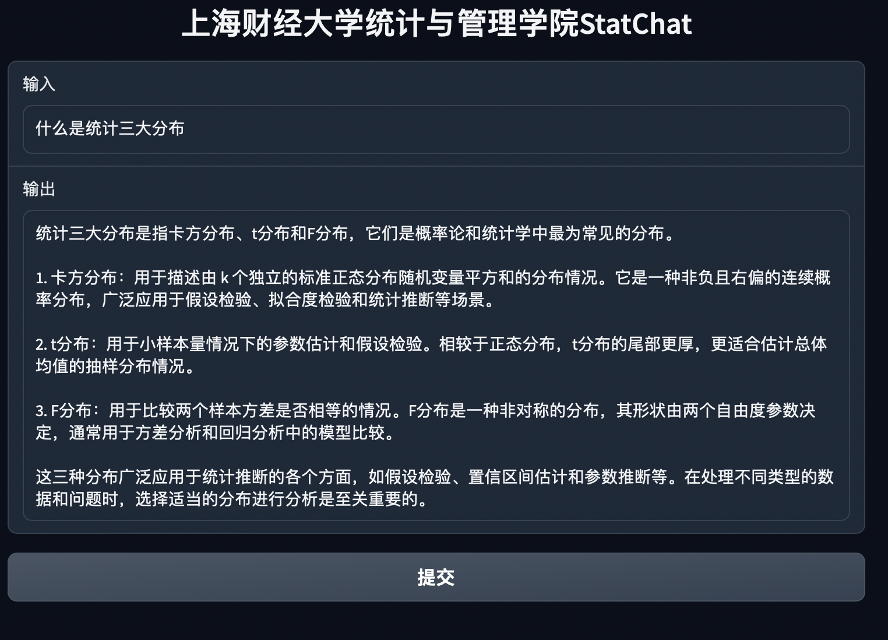
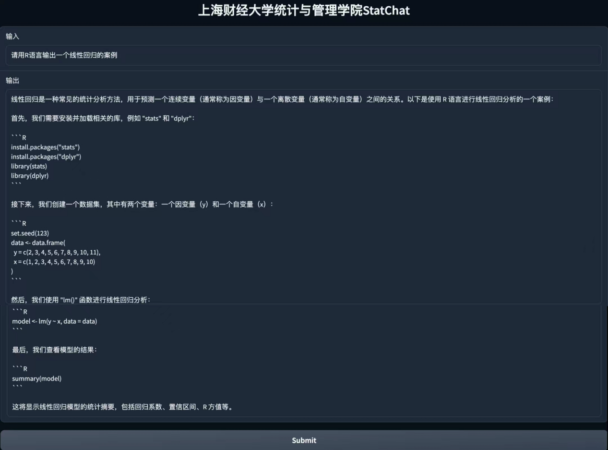

<div align="center">
  
  <br />
  <br />
</div>


基于大语言模型的蓬勃发展和广泛应用，现上海财经大学统计与管理学院张立文副教授团队开发设计了一款统计学大模型StatChat，专项应用于统计学领域知识问答，包括其基础概念解惑、相关R语言和Python语言代码解答等方面。这一大模型可以作为学院学生的数字化智能学习助手，能够很好地在与学生的互动中传授知识、答疑解惑，从而极大提升学生的学习积极性和学习效率。

## 构建意义

随着大语言模型（LLM）的快速发展和广泛应用，它们已在金融、医药等多个专业领域展现出巨大的潜力和实用价值。这些模型通过深度学习和大量数据训练，为专业人士提供了强大的决策支持工具。然而，在统计学这一关键学科领域，尚未出现专门针对该学科需求设计的大模型。统计学作为数据科学的核心，其理论和方法在各行各业中都发挥着重要作用，因此，开发专门的统计学大模型显得尤为重要和迫切。

在高校教育环境中，学生在学习统计学的过程中经常会遇到各种各样的难题和疑问。这些问题可能涉及复杂的统计概念、数据分析方法或编程技巧。由于各种原因，比如羞于提问、担心被误解等，学生可能不愿意直接向老师寻求帮助。同时，教师由于课程安排和研究任务繁重，未必能随时提供即时的个性化指导。因此，一个专门设计的统计学大模型，作为一种智能学习助手，可以有效弥补这一空白，帮助学生在学习过程中自主解决问题，提高自主学习的能力。

StatChat统计学大模型的设计团队源自上海财经大学统计与管理学院，由张立文副教授领衔。该模型依据培养方案的划分涵盖两大类：统计学基础课程与统计学应用课程。学生通过这一模型，不仅能够系统学习统计学的基本概念、理论和方法，还能掌握如何运用R语言和Python语言进行数据处理和建模。此外，模型还提供了一系列实例，指导学生如何运用统计学方法分析金融市场、宏观经济和微观经济现象，从而培养他们的经济学分析和决策能力。例如，模型演示了如何利用R语言进行数据分析，以及如何借助Python实现复杂的统计算法。这些实践环节对于提高学生的实际操作能力和解决实际问题的能力至关重要。通过StatChat模型，学生在统计学的理论学习与实践应用之间能够无缝衔接，为他们的学术发展和职业生涯打下坚实的基础。

<div align="center">
  
  <br />
  <br />
</div>

统计学基础课程旨在培养学生掌握统计学的基本理论和方法，主要包括概率论、统计学/数理统计、线性回归和多元统计分析等课程。概率论课程让学生理解和掌握随机现象的规律性和不确定性，培养逻辑思维和推理能力；统计学/数理统计课程则教授学生如何分析和解释数据，以推断总体的特性，培养基本的数据分析能力；线性回归课程教授学生如何建立自变量和因变量之间的线性关系模型，进行预测和解释，培养模型构建和数据分析能力。多元统计分析课程则进一步扩展了线性回归的内容，让学生掌握多个自变量与因变量之间的复杂关系，培养综合分析和解决实际问题的能力。通过这些基础课程的学习，学生将具备扎实的统计学基础知识和技能，掌握一定建模和数据分析的能力，为更高阶统计学课程的学习打下基础。

统计学应用课程旨在培养学生将统计学理论和方法应用于实际问题解决的能力，主要包括R语言应用、Python语言应用、时间序列分析、金融学、宏观经济学、微观经济学和机器学习等课程。R语言应用和Python语言应用课程教授学生如何使用这两种编程语言进行数据处理、可视化和建模，培养数据分析和编程能力；时间序列分析课程让学生掌握时间数据的特性、建模和分析方法，培养对时间序列数据的理解和预测能力；金融学、宏观经济学和微观经济学课程将统计学与经济学相结合，让学生能够运用统计学方法分析金融市场、宏观经济和微观经济现象，培养经济学分析和决策能力；机器学习课程则教授学生如何运用统计学原理和方法构建和应用机器学习模型，培养人工智能和数据分析能力。通过这些应用课程的学习，学生将能够将统计学知识应用于金融等领域，解决实际问题，并具备数据分析和决策的能力。

总之，这款统计学大模型不仅能够提高学生对统计学的学习兴趣，还能通过实时反馈和互动学习提高学习效率。更重要的是，该团队计划对模型进行持续的迭代和优化，以确保其内容保持更新，与统计学领域的最新发展同步。随着技术的不断进步和教学方法的不断创新，这款模型有望成为高校统计学教育的重要辅助工具，为培养数据时代的新型人才提供强有力的支持。

## **结果展示**

现在此分别展示StatChat针对四个提问的具体回答效果，问题分别包括一道自我身份识别题，一道统计学概念基础题，一道统计学概念拔高题和一道R语言代码题，较为全面地展示了大模型的效果。

<div align="center">
  
  <br />
  <br />
</div>

<div align="center">
  
  <br />
  <br />
</div>

<div align="center">
  
  <br />
  <br />
</div>

<div align="center">
  
  <br />
  <br />
</div>
展望未来，我们期待统计学大模型与金融大模型的深度结合，形成具有上海财经大学特色的大模型，这样的结合将充分发挥统计学在数据分析和决策支持中的核心作用，同时融入金融学的专业知识，为学生在金融领域的应用提供强有力的支撑。通过这种跨学科的合作，学生将有机会学习如何将统计学原理应用于金融市场的风险管理和资产定价，以及如何利用金融模型来分析经济数据，预测市场趋势。例如，结合统计学模型和金融工程技术，学生可以探索如何开发新的金融衍生品，或者如何评估金融机构的稳健性。此外，通过模拟真实的金融市场环境和决策场景，学生能够从中锻炼自己的实战能力，为将来在金融行业的工作做好准备。这样的特色经管模型不仅能够提升学生的专业素养，还能够加强他们在就业市场上的竞争力，为社会培养出更多具备创新精神和实践能力的经济管理人才。进一步地，这一大模型有望突破学科的界限，扩展至物理化学等领域，最终构建出一个涵盖多元学科内容的大模型。这将为学生提供一个全面的学习平台，使他们能够在跨越学科边界的过程中，将不同学科的知识与技能融合，激发创造力，培养实践能力，同时为未来的职业生涯做好准备。

## 测试链接

```text
https://xxx.com/xxx/xxx.xxx
```


